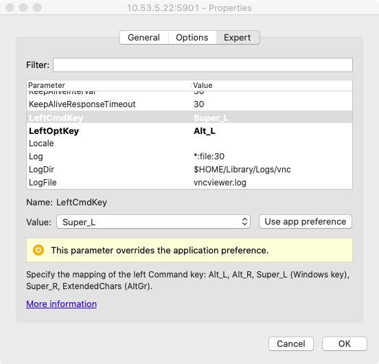

# 配置VNC客户端 

1. 下载客户端[VNC® Viewer](https://www.realvnc.com/en/connect/download/viewer/)
2. 修改连接属性，将 cmd 和 opt 键的配置设置正确，
3. 用全屏模式，保证特殊按键能够被正确捕获
   

# 桌面系统i3-gaps

详细参考 https://i3wm.org/docs/userguide.html  
具体配置在 ```~/.config/i3/config```

# 使用

## 按键配置

```$mod = Mod4```  ：使用Mod4作为i3的Modifier 

 Mod4在不同平台上的对应按键     
|   os   |       key        |
| :----: | :--------------: |
| macosx | <kbd>super</kbd> |
| linux  |  <kbd>win</kbd>  |
 
 
## 基本命令
| 按键                                          | 用途           |
| --------------------------------------------- | :------------- |
| <kbd>$mod</kbd>+<kbd>数字</kbd>               | 切换桌面       |
| <kbd>$mod</kbd>+<kbd>Enter</kbd>              | 打开 terminal:urxvt  |
| <kbd>$mod</kbd>+<kbd>d </kbd>                 | 打开应用菜单   |
| <kbd>$mod</kbd>+<kbd>F4</kbd>                 | 关闭当前应用   |
| <kbd>$mod</kbd>+<kbd>m</kbd>                  | toogle顶部状态栏 |

## 中文输入法
启动命令： ```ibus-daemon -drm```  
切换输入法: <kbd>$ctrl</kbd>+<kbd>space</kbd>  
 

## 远程桌面

```bash
#开启远程桌面
vncserver -geometry 1440x900
#查看当前远程桌面会话
vncserver -list
#杀掉远程桌面会话
vncserver -kill  :1
#修改远程桌面密码
vncpasswd
```

## 修改桌面分辨率
```bash
# 参考脚本
~/.bin/vm-mackbook.sh
~/.bin/vm-desktop.sh
```
或者使用 xrandr
[添加自定义分辨率](https://wiki.archlinux.org/index.php/Xrandr#Adding_undetected_resolutions)
```bash
xrandr --newmode "2560x1440" 241.50 2560 2600 2632 2720 1440 1443 1448 1481 -hsync +vsync
xrandr --addmode VNC-0 2560x1440
xrandr --output VNC-0 --mode 2560x1440
```
# 附录
## 查看键盘映射

i3wm 的 mod 键配置
`set $mod Mod4`  
通过命令`xmodmap` 查看本机键盘映射

```bash
xmodmap
xmodmap:  up to 4 keys per modifier, (keycodes in parentheses):

shift       Shift_L (0x32),  Shift_R (0x3e)
lock        Caps_Lock (0x42)
control     Control_L (0x25),  Control_R (0x6d)
mod1        Alt_L (0x40),  Alt_R (0x71),  Meta_L (0x9c)
mod2        Num_Lock (0x4d)
mod3
mod4        Super_L (0x73),  Super_R (0x74),  Super_L (0x7f),  Hyper_L (0x80)
mod5        Mode_switch (0x8),  ISO_Level3_Shift (0x7c)

```
